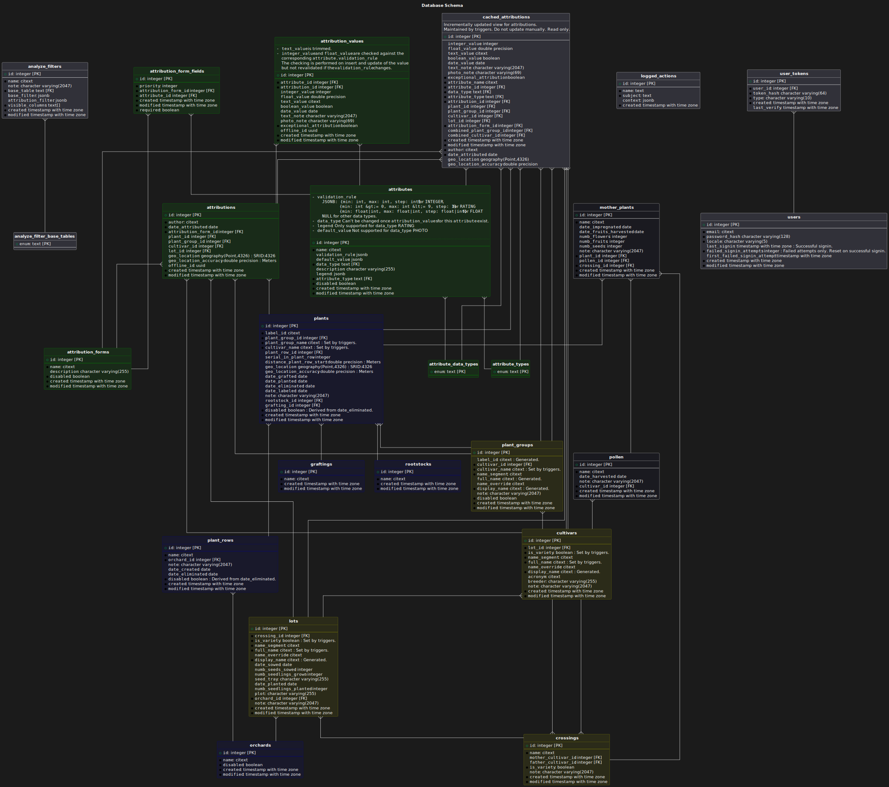

# Database

[PostgreSQL](https://www.postgresql.org/docs/16/index.html) >= 16

## UML

The UML is generated. See [Updating the UML](#updating-the-uml).

### Updating the UML

To update the UML, run `./generate-uml.sh`.

The script relies on [Planter](https://github.com/achiku/planter) and
[PlantUML](https://plantuml.com/).
